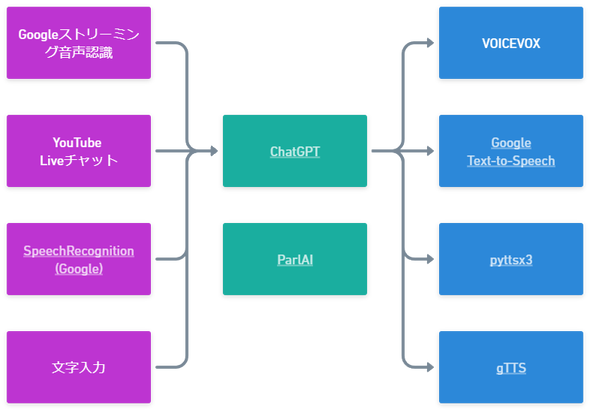

<p align="center">

</p>
<p align="center">
  susumu ai dialogue system<br/><br/>
</p>

<p align="center">
  <a href="#特徴">特徴</a> •
  <a href="#動作環境">動作環境</a> •
  <a href="#実行方法">実行方法</a> •
  <a href="#使い方">使い方</a> •
  <a href="#カスタマイズ">カスタマイズ</a> •
  <a href="#対応モジュール">対応モジュール</a> •
  <a href="#python%E3%81%A7%E5%8B%95%E3%81%8B%E3%81%99">Pythonで動かす</a>
  <br>
</p>

## 特徴

`susumu-ai-dialogue-system` は音声認識や音声合成のモジュールを入れ替えて実行できるAI音声対話/AI VTuberシステムです。  
各モジュールの切り替えは設定画面でワンクリックで行えます。
<br/>

<p align="center">

</p>


### AI VTuber

AI VTuberを作るために必要ないくつかの機能をプログラミング不要で実現します。具体的には `YouTuber Data API v3` を使ったYouTubeライブ配信のコメント取得、 `OBS`
を使った字幕更新に対応しています。

<br/>

## 動作環境

Windows 11のみ  
Windowsに依存しない形で作っていますが、他の環境では動作確認ができていません。

<br/>

## 実行方法

[リリースページ](https://github.com/sato-susumu/susumu-ai-dialogue-system/releases)にある `susumu_toolbox_x.x.x.zip`をダウンロードします。  
ダウンロードしたzipを解凍し、 `susumu_toolbox.exe`を実行します。

<br/>

## 使い方

### クイックスタート

`OpenAI API Key` を取得し、設定画面で設定すれば、まずは最低限の音声対話が動作します。

<br/>

### OpenAI API Keyを設定する

`susumu_toolbox.exe` を起動すると、`設定` ボタンがあるのでクリックします。 `OpenAI API Key` を入力し、`保存して閉じる`をクリックすればAPI Keyの設定は完了です。

<br/>

### 音声対話を使ってみる

`OpenAI API Key` を設定すれば、あとは初期設定で音声対話を試すことができます。`起動`ボタンを押せば、音声対話が開始します。音声認識結果や `ChatGPT`
からの応答はコンソール画面に表示されます。

<br/>

### 音声認識や音声合成をリッチにする

設定画面の `共通設定` タブで、どの音声認識や音声合成を使うか選択できます。使う機能によっては別のタブで設定を行ったり、別のアプリの起動が必要になる事もあります。

<br/>

### AI VTuberを動かす

`susumu-ai-dialogue-system` を使えば、プログラミングを行わなくてもAI VTuber(絵や3Dキャラクターを除く)を動かすことができます。
AI VTuberとして動かすためには次のステップを踏むだけ、、、ですが、正直なところ、初めてだと敷居がとても高いです。

- `Google Cloud Platform`で `API Key` を発行し、設定画面で `YouTubeコメント取得` に必要な設定を行う
- `OBS Studio` をインストールし、字幕表示に必要な設定を行う
- 設定画面の `共通設定` タブで、「ベース機能」は`AI VTuber`、「入力」は `YouTubeコメント取得` 、「その他」は `OBS出力` をONにする

なお、`susumu-ai-dialogue-system`には絵や3Dキャラクターを動かす機能はないため、 `VMagicMirror`などで別のアプリで3Dキャラクターなどを動かす必要があります。

<br/>

## カスタマイズ

### 簡単なカスタマイズ

`ChatGPT` 使用時は、設定画面の `AI設定` タブで、プロンプトの内容を変更し、AIの性格や口調を変更できます。
プログラムの挙動も含めてカスタマイズするためには、Pythonを使って `susumu-ai-dialogue-system`のソースコードを直接動かす必要があります。

<br/>

## 対応モジュール
### オプション

| カテゴリ | モジュール | 条件        |
| -------- | ---------- | ------------------ |
| 翻訳 | [Googletrans](https://github.com/ssut/py-googletrans) |  |
| 翻訳 | [DeepL API](https://www.deepl.com/) | API認証キーが必要 |
| オプション | OBS連携 | OBS Studioの起動と設定が必要 |
| オプション | 感情解析 | [詳細説明](./docs/emotion_analysis.md) |
| オプション | VMagicMirror連携 | [詳細説明](./docs/vmagic_mirror_option.md) |

<br/>

## Pythonで動かす

PythonやGitの知識があれば、次の方法で動かすことができます。
Pythonの動作確認バージョンは3.10です。

```
git clone https://github.com/sato-susumu/susumu-ai-dialogue-system.git
cd susumu-ai-dialogue-system
pip install -r requirements.txt
python main.py
```

Windows環境でビルドするためには、事前に[Microsoft C++ Build Tools](https://visualstudio.microsoft.com/ja/visual-cpp-build-tools/)
のインストールが必要です。
