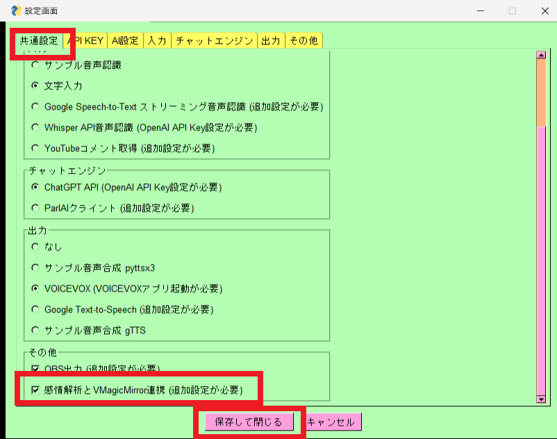

### 感情解析オプション
#### 感情解析オプションとは
感情解析オプションは、文章から感情を推定するためのオプション機能です。
 

#### 設定方法
まず、下記のURLからzipファイルをダウンロードしてください。

https://github.com/sato-susumu/susumu_toolbox_ml_model/releases/download/v0.1.0/wrime_model.pth.zip

次に、zipファイルを解凍して、解凍したフォルダをmodel_dataフォルダに配置してください。model_dataフォルダはアプリを初めて起動したときに自動的に作成されます。

 
#### susumu_toolboxの設定

 
