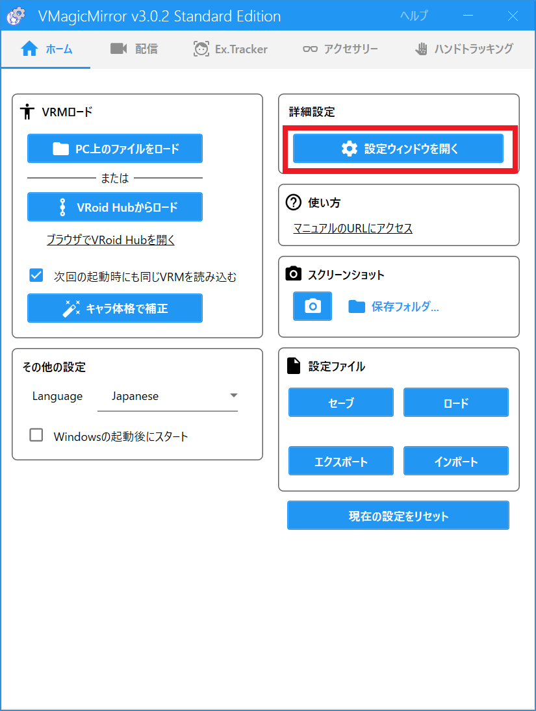
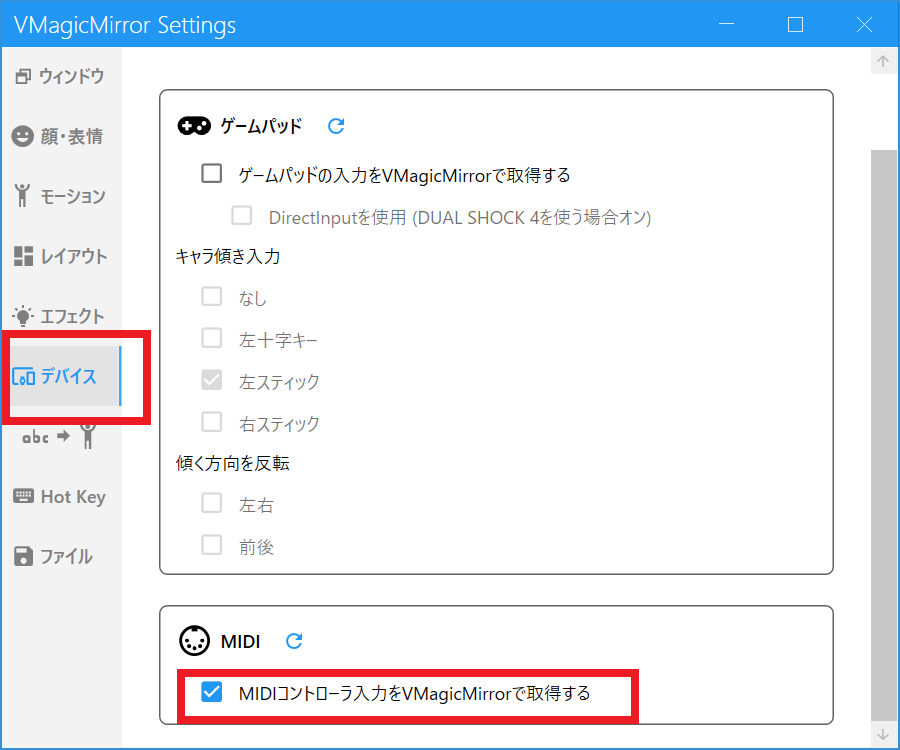
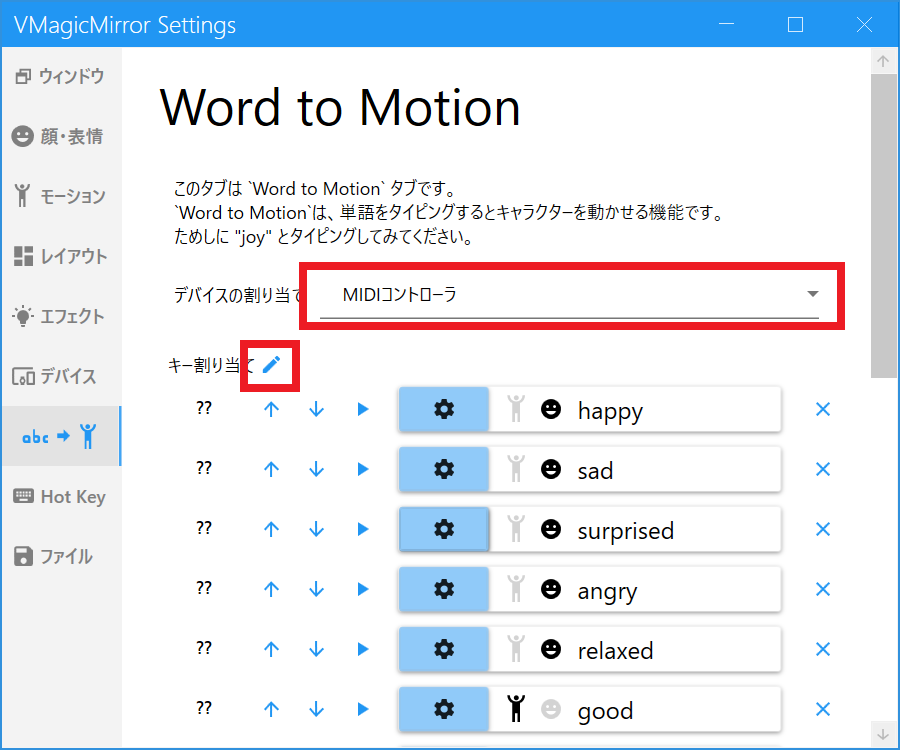
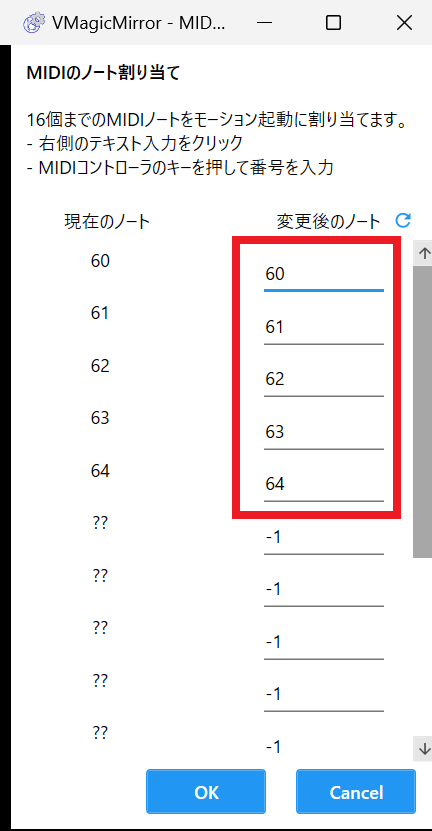
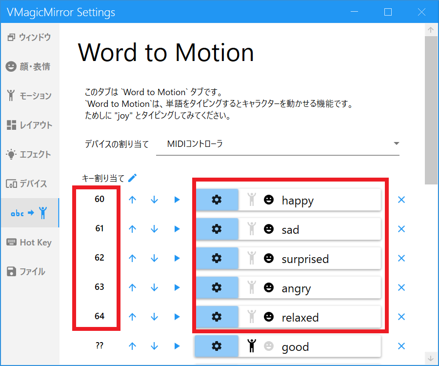

### VMagicMirror連携
#### VMagicMirror連携とは
VMagicMirror連携とは、人間の3Dアバターを動かすための実験的な位置付けの機能です。この機能を使用するには、VRMアバターを動かすアプリである「VMagicMirror」を使います。このアプリは、MIDIからの入力でアバターを動かすことができます。そのため、susumu_toolboxからMIDIを制御し、VMagicMirrorで表情を変化させます。

このためには、仮想MIDIケーブルである「loopMIDI」をインストールし、設定する必要があります。  
loopMIDIの設定方法については、[こちら](https://music-dtm.com/dtm/loopmidi-install)の説明が詳しいです。

#### VMagicMirror連携を使うための事前準備
感情解析オプションの設定が必要
VMagicMirrorアプリのインストール
 

#### VMagicMirrorの設定

 

 

 

 

 

#### susumu_toolboxの設定

 

